# Manual do ReportsHowie

Gerador de relatórios *banded* para Delphi (VCL) — alternativa livre ao FastReport/QuickReport, em Pascal puro e sem dependências externas. Licença **LGPL-3.0**.

> Este manual é um documento vivo. Cada recurso traz exemplos prontos para copiar. Os trechos de código assumem `uses` com as units da seção [2. Instalação](#2-instalação).

## Índice

1. [Conceitos fundamentais](#1-conceitos-fundamentais)
2. [Instalação](#2-instalação)
3. [Seu primeiro relatório (em código)](#3-seu-primeiro-relatório-em-código)
4. [Bandas](#4-bandas)
5. [Objetos (texto, imagem, linha, forma)](#5-objetos)
6. [Fonte, alinhamento, cores e moldura](#6-fonte-alinhamento-cores-e-moldura)
7. [Expressões `[ilha]`](#7-expressões-ilha)
8. [Ligação com dados (data binding)](#8-ligação-com-dados-data-binding)
9. [Agrupamento e agregados](#9-agrupamento-e-agregados)
10. [Master-detail](#10-master-detail)
11. [Conectando a um banco (FireDAC/PostgreSQL)](#11-conectando-a-um-banco-firedacpostgresql)
12. [Pré-visualização (embutida vs. externa)](#12-pré-visualização)
13. [Exportação (HTML, PDF, XLSX, DOCX)](#13-exportação)
14. [Persistência (`.rhr` e DFM)](#14-persistência)
15. [Designer visual (design-time)](#15-designer-visual)
16. [Impressão](#16-impressão)
17. [Receitas rápidas](#17-receitas-rápidas)
18. [Solução de problemas](#18-solução-de-problemas)
19. [Relatórios fiscais (DANFE, NFC-e, DACTE, DAMDFE, NFS-e, DACCE)](#19-relatórios-fiscais)
20. [Galeria de demos](#20-galeria-de-demos)

---

## 1. Conceitos fundamentais

- **Modelo em bandas**: um relatório é uma pilha de *bandas* (título, cabeçalho, dados, rodapé…). A banda de dados repete uma vez por registro; as demais aparecem em pontos específicos.
- **Unidade interna = 0,1 mm (inteiro)**: independente de dispositivo. Você quase nunca digita o número cru — usa os *helpers* de conversão:

| Helper | Converte para |
|---|---|
| `MMToUnits(mm)` | unidade interna (0,1 mm) — **o que você usa ao montar** |
| `MMToPx`, `MMToPt`, `MMToTwips`, `MMToEMU` | pixels, pontos, twips, EMU (usados internamente pelos exports) |

Ex.: `MMToUnits(190)` = 1900 (= 190 mm de largura útil do A4).

- **Display list única**: o motor renderiza para um documento intermediário (`TrhRenderedDocument`). **Preview, impressão e todos os exports consomem essa mesma lista** → o que você vê é o que sai (WYSIWYG), e `[TOTALPAGES]` sai de graça.
- **Dados genéricos**: qualquer `TDataSet` (FireDAC, ADO, dbExpress, memtable…). O componente não acopla driver.

---

## 2. Instalação

1. Instale o pacote **`ReportsHowieRT`** (runtime) e **`ReportsHowieDT`** (design-time) pela IDE. Só o `TrhReport` cai na paleta ("ReportsHowie").
2. No projeto que consome a lib, adicione ao **Search Path** (Project → Options → Building → Delphi Compiler → Search path):

```
...\ReportsHowie\source\core;...\source\model;...\source\render;...\source\preview;...\source\expr;...\source\data;...\source\export\html;...\source\export\pdf;...\source\export\ooxml
```

3. `uses` típico de uma aplicação:

```pascal
uses
  rh.Types, rh.Report, rh.Page, rh.Bands, rh.Objects, rh.Model.Types,
  rh.Render.Intf, rh.Expr.Nodes, rh.Data.Pipeline,
  rh.Preview.Form,      // ShowPreview / ShowDataPreview (janela)
  rh.Preview.Control,   // TrhPreviewControl (preview embutida no form)
  rh.Export.HTML, rh.Export.PDF, rh.Export.XLSX, rh.Export.DOCX;
```

> Community Edition não compila por linha de comando — o build é feito pela IDE.

---

## 3. Seu primeiro relatório (em código)

**Exemplo 1 — relatório mínimo com um título e uma banda de dados:**

```pascal
var
  Page: TrhPage;
  Band: TrhBand;
  T: TrhTextObject;
begin
  rhReport1.Clear;
  rhReport1.Title := 'Ola ReportsHowie';
  Page := rhReport1.EnsurePage;          // cria/retorna a 1a pagina (A4 retrato)

  // banda de titulo (aparece uma vez)
  Band := Page.Bands.AddBand(rhbtReportTitle);
  Band.Height := MMToUnits(15);
  T := Band.Objects.AddNew<TrhTextObject>;
  T.Text := 'Meu primeiro relatorio';
  T.Left := 0;  T.Top := MMToUnits(2);
  T.Width := MMToUnits(190);  T.Height := MMToUnits(10);
  T.Font.Size := 16;
  T.HAlign := rhhaCenter;

  rhReport1.ShowPreview;                  // mostra na tela (sem dados)
end;
```

> **Left/Top são relativos à área de conteúdo** da banda — a margem da página já é aplicada pelo motor. A largura útil do A4 retrato é 190 mm (210 − 10 − 10).

Um *helper* que encurta a criação de textos (usado no resto do manual):

```pascal
function NovoTexto(Band: TrhBand; const Texto: string; TopMM, HeightMM: Integer;
  Align: TrhHAlign = rhhaLeft): TrhTextObject;
begin
  Result := Band.Objects.AddNew<TrhTextObject>;
  Result.Text := Texto;
  Result.Left := 0;
  Result.Top := MMToUnits(TopMM);
  Result.Width := MMToUnits(190);
  Result.Height := MMToUnits(HeightMM);
  Result.HAlign := Align;
end;
```

---

## 4. Bandas

Tipos disponíveis (`TrhBandType`) e quando aparecem:

| Tipo | Aparece |
|---|---|
| `rhbtReportTitle` | uma vez, no início do relatório |
| `rhbtPageHeader` | topo de cada página |
| `rhbtPageFooter` | rodapé de cada página |
| `rhbtGroupHeader` | ao iniciar um grupo (ver `GroupExpression`) |
| `rhbtMasterData` | **uma vez por registro** do dataset mestre |
| `rhbtDetailData` | uma vez por registro do dataset detalhe (master-detail) |
| `rhbtGroupFooter` | ao fechar um grupo (bom para subtotais) |
| `rhbtSummary` | uma vez, no fim (totais gerais) |
| `rhbtChild` | banda auxiliar ancorada a outra |

**Exemplo 2 — adicionar bandas e definir altura:**

```pascal
var Page: TrhPage; BTitle, BData, BFooter: TrhBand;
begin
  Page := rhReport1.EnsurePage;
  BTitle  := Page.Bands.AddBand(rhbtReportTitle);  BTitle.Height  := MMToUnits(18);
  BData   := Page.Bands.AddBand(rhbtMasterData);   BData.Height   := MMToUnits(6);
  BFooter := Page.Bands.AddBand(rhbtPageFooter);   BFooter.Height := MMToUnits(6);
end;
```

Propriedades úteis da banda:

- `DataSetName` — nome do dataset que dirige a iteração (na master).
- `GroupExpression` — expressão que define a quebra de grupo (nos group header/footer).
- `Height` — altura em unidades (use `MMToUnits`).

---

## 5. Objetos

Todo objeto tem `Left/Top/Width/Height` (em unidades, via `MMToUnits`), `Visible` e `Frame` (moldura). Adicione com `Band.Objects.AddNew<T>`.

### 5.1 Texto — `TrhTextObject`

```pascal
T := Band.Objects.AddNew<TrhTextObject>;
T.Text := 'Cliente: [nome]';   // pode misturar texto fixo + ilhas [expr]
T.Font.Size := 12;
T.Font.Style := [fsBold];
T.HAlign := rhhaRight;         // rhhaLeft | rhhaCenter | rhhaRight
T.WordWrap := True;
T.Color := clWhite;            // cor de fundo
T.Transparent := True;         // fundo transparente
```

Também aceita **bind direto** a um campo via `DataField` (ver seção 8).

### 5.2 Imagem — `TrhImageObject`

**Exemplo 3 — imagem fixa (logo):**

```pascal
var Img: TrhImageObject;
begin
  Img := Band.Objects.AddNew<TrhImageObject>;
  Img.Left := 0; Img.Top := 0;
  Img.Width := MMToUnits(40); Img.Height := MMToUnits(20);
  Img.Picture.LoadFromFile('C:\logo.png');
  Img.KeepAspect := True;   // mantem proporcao
  Img.Center := True;
end;
```

**Exemplo 4 — imagem vinda de um campo (foto do cliente):**

```pascal
Img := Band.Objects.AddNew<TrhImageObject>;
Img.DataField := 'foto';   // le o campo blob 'foto' do dataset da banda
Img.Stretch := True;
```

### 5.3 Linha — `TrhLineObject`

```pascal
var Lin: TrhLineObject;
begin
  Lin := Band.Objects.AddNew<TrhLineObject>;
  Lin.Left := 0; Lin.Top := MMToUnits(8);
  Lin.Width := MMToUnits(190); Lin.Height := 0;   // Height=0 => linha horizontal
  Lin.PenColor := clSilver;
  Lin.PenWidth := MMToUnits(1);   // ~0,3 mm; use valor pequeno
end;
```

### 5.4 Forma — `TrhShapeObject`

```pascal
var Shp: TrhShapeObject;
begin
  Shp := Band.Objects.AddNew<TrhShapeObject>;
  Shp.Kind := rhskRoundRect;   // rhskRectangle | rhskRoundRect | rhskEllipse
  Shp.Left := 0; Shp.Top := 0;
  Shp.Width := MMToUnits(190); Shp.Height := MMToUnits(8);
  Shp.PenColor := clGray;
  Shp.BrushColor := $00F5F5F5;   // cinza bem claro (BGR)
  Shp.Transparent := False;      // False => preenche com BrushColor
end;
```

---

## 6. Fonte, alinhamento, cores e moldura

**Exemplo 5 — cabeçalho destacado com fundo e moldura inferior:**

```pascal
T := NovoTexto(BGH, 'Categoria: [categoria]', 1, 6);
T.Font.Name := 'Segoe UI';
T.Font.Size := 11;
T.Font.Style := [fsBold];
T.Font.Color := clNavy;
T.Color := $00F0F0F0;          // fundo cinza claro (BGR, nao RGB!)
T.Transparent := False;
T.Frame.Sides := [rhfsBottom]; // moldura so embaixo
T.Frame.Color := clSilver;
T.Frame.Width := MMToUnits(1);
```

> **Cores em Delphi são BGR** (`$00BBGGRR`), não RGB. Use as constantes `clNavy`, `clSilver`, etc., ou `RGB(r,g,b)`.

Alinhamento horizontal: `rhhaLeft`, `rhhaCenter`, `rhhaRight`.
Alinhamento vertical: `rhvaTop`, `rhvaCenter`, `rhvaBottom`.

---

## 7. Expressões `[ilha]`

Dentro de `Text`, qualquer coisa entre `[` e `]` é uma **expressão avaliada**; o resto é texto literal. Você pode ter várias ilhas num mesmo objeto.

```
Total: R$ [FORMATFLOAT('#,##0.00', [valor])]   ->   Total: R$ 1.234,50
```

### 7.1 Campos

`[nome_do_campo]` lê o campo do registro atual (case-insensitive). Ex.: `[cliente]`, `[total]`.

### 7.2 Operadores

Aritméticos `+ - * / `, comparação `= <> < <= > >=`, lógicos `and or not`, concatenação de strings com `+`. Parênteses controlam precedência.

### 7.3 Funções

| Categoria | Funções |
|---|---|
| Texto | `UPPER(s)`, `LOWER(s)`, `TRIM(s)`, `LEN(s)`, `COPY(s,ini,qtd)`, `POS(sub,s)` |
| Lógica | `IIF(cond, a, b)`, `COALESCE(a, b, ...)` |
| Número | `ROUND(x)`, `TRUNC(x)`, `INT(x)`, `ABS(x)` |
| Formatação | `FORMATFLOAT(mascara, x)`, `FORMATDATETIME(mascara, dt)`, `DATETOSTR(dt)`, `STR(x)` |
| Data/hora | `NOW`, `DATE`/`TODAY`, `TIME` |
| Constantes | `TRUE`, `FALSE`, `NULL`, `PI` |

### 7.4 Pseudo-variáveis

- `[PAGE]` — número da página atual.
- `[TOTALPAGES]` — total de páginas (o motor faz 2 passadas).

**Exemplo 6 — vários usos:**

```pascal
NovoTexto(B, 'Emitido em [FORMATDATETIME(''dd"/"mm"/"yyyy hh":"nn'', NOW)]', 0, 5);
NovoTexto(B, 'Pagina [PAGE] de [TOTALPAGES]', 0, 5, rhhaRight);
NovoTexto(B, 'Situacao: [IIF([saldo] < 0, ''DEVEDOR'', ''OK'')]', 0, 5);
NovoTexto(B, 'Nome: [UPPER(TRIM([nome]))]', 0, 5);
NovoTexto(B, 'Preco: R$ [FORMATFLOAT(''#,##0.00'', [preco])]', 0, 5);
```

> Dentro de uma string Pascal, aspas simples são duplicadas: `''#,##0.00''`.

### 7.5 Parâmetros de relatório — `SetParam`

Valores que pertencem ao **relatório** (não à linha de dados) — um título dinâmico, um flag "exibe valor", a data de referência — são **parâmetros**. Defina-os em código antes do preview/export; eles resolvem nas ilhas `[ ]` como se fossem campos, **sem** virar coluna repetida no dataset.

```pascal
rhReport1.SetParam('titulo', 'ORDEM DE PRODUÇÃO - VALORADA');
rhReport1.SetParam('exibe_valor', 'S');
// no template:  [titulo]     e     [exibe_valor]
```

**Precedência de resolução:** campo do dataset › parâmetro › pseudo-variável. Parâmetros são *runtime* (não são gravados no `.rhr`). No `rhtool`: `--param nome=valor` (repetível).

### 7.6 Visibilidade condicional — `VisibleExpr`

Tanto **objetos** quanto **bandas** têm, além do booleano estático `Visible`, uma propriedade `VisibleExpr`: uma expressão avaliada **por linha**; se der falso, o objeto/banda não é emitido. Vazia = comportamento de `Visible`. Assim **um único** `.rhr` serve variantes (com/sem uma coluna, por exemplo), controladas por um campo ou parâmetro:

```pascal
Col.VisibleExpr  := '[exibe_valor]=''S''';   // esconde a coluna de valor
Total.VisibleExpr := '[exibe_valor]=''S''';  // esconde a banda de total
```

Resultado verdadeiro = visível para: não-zero, ou as strings `S`/`SIM`/`TRUE`/`T`/`Y`/`1`. No preview de layout (sem dados) nada é escondido. Veja o demo `demos/visibilidade` (exporte com `--param exibe_valor=S` e depois `=N`).

### 7.7 Comportamento com `NULL` (null-safe)

O motor é **null-safe**: um campo `NULL` nunca faz a ilha "vazar" o texto cru da expressão.

- Comparações com `NULL` (`[x] > 0`, `[x] = y`, …) resultam **falso** (não lançam).
- `FORMATFLOAT`/`FORMATDATETIME`/`DATETOSTR` sobre `NULL` devolvem **string vazia**; `ROUND`/`TRUNC`/`INT`/`ABS` devolvem `NULL`.
- Aritmética com operando `NULL` resulta `NULL`.

```
[IIF([valor] > 0, FORMATFLOAT('#,##0.00', [valor]), '')]
```

Com `[valor]` nulo ou `0`, a célula sai **em branco**. Se uma expressão realmente falhar (erro de sintaxe), em produção a saída é vazia; para depurar no designer, ligue `rhExprShowRawOnError := True` (unit `rh.Expr`) e o literal da ilha reaparece.

---

## 8. Ligação com dados (data binding)

O ReportsHowie oferece **dois modos** (híbrido) — use o que preferir, inclusive misturados:

### 8.1 Modo simples: `DataField` (estilo DB-aware)

Aponte **um** campo. Ideal para arrastar/soltar e para quem quer o básico.

```pascal
T := Band.Objects.AddNew<TrhTextObject>;
T.DataField := 'cliente';   // exibe o valor do campo 'cliente'
```

`DataField` tem **precedência** sobre `Text`. Internamente ele vira a ilha `[cliente]`, então usa o mesmo motor.

### 8.2 Modo avançado: ilhas `[expr]` no `Text`

Permite concatenar, formatar e agregar num só objeto:

```pascal
T.Text := '[cliente] ([uf]) - R$ [FORMATFLOAT(''#,##0.00'', [total])]';
```

### 8.3 Ligando o dataset em runtime

A banda diz **qual** dataset itera (`DataSetName`); no runtime você amarra o nome a um `TDataSet` real:

```pascal
BData.DataSetName := 'Pedidos';
// ...
rhReport1.SetDataSet('Pedidos', MinhaQuery);   // 'Pedidos' == BData.DataSetName
```

**Exemplo 7 — relatório de dados completo (memtable):**

```pascal
var Mem: TFDMemTable; Page: TrhPage; BData: TrhBand;
begin
  Mem := TFDMemTable.Create(Self);
  Mem.FieldDefs.Add('Cliente', ftString, 40);
  Mem.FieldDefs.Add('Valor', ftCurrency);
  Mem.CreateDataSet;
  Mem.AppendRecord(['ACME Ltda', 1234.50]);
  Mem.AppendRecord(['Beta Saude', 900.00]);
  Mem.First;

  rhReport1.Clear;
  Page := rhReport1.EnsurePage;
  BData := Page.Bands.AddBand(rhbtMasterData);
  BData.DataSetName := 'Vendas';
  BData.Height := MMToUnits(6);
  NovoTexto(BData, '[Cliente] - R$ [FORMATFLOAT(''#,##0.00'', [Valor])]', 0, 6);

  rhReport1.SetDataSet('Vendas', Mem);
  rhReport1.ShowDataPreview;   // preview COM dados
end;
```

> **`ShowPreview` × `ShowDataPreview`**: `ShowPreview` renderiza o layout estático (sem percorrer dados); `ShowDataPreview` roda o pipeline de dados (itera registros, agrupa, agrega). Para relatórios com banco, use `ShowDataPreview`.

---

## 9. Agrupamento e agregados

Para agrupar, use um par **group header / group footer** com a mesma `GroupExpression`. Os registros precisam vir **ordenados** pela expressão de grupo (contíguos).

Agregados: `SUM`, `AVG`, `COUNT`, `MIN`, `MAX`, `FIRST`, `LAST`. O **escopo é a banda** onde o agregado está: no group footer → total do grupo; no summary → total geral.

**Exemplo 8 — vendas por categoria com subtotal e total geral:**

```pascal
// cabecalho de grupo
BGH := Page.Bands.AddBand(rhbtGroupHeader);
BGH.GroupExpression := '[categoria]';
BGH.Height := MMToUnits(8);
T := NovoTexto(BGH, 'Categoria: [categoria]', 1, 6);
T.Font.Style := [fsBold];

// dados
BData := Page.Bands.AddBand(rhbtMasterData);
BData.DataSetName := 'Pedidos';
BData.Height := MMToUnits(6);
NovoTexto(BData, '   [produto]  x[quantidade]  =  R$ [FORMATFLOAT(''#,##0.00'', [total])]', 0, 6);

// rodape de grupo => SUBTOTAL do grupo
BGF := Page.Bands.AddBand(rhbtGroupFooter);
BGF.GroupExpression := '[categoria]';
BGF.Height := MMToUnits(7);
T := NovoTexto(BGF, 'Subtotal [categoria]: R$ [FORMATFLOAT(''#,##0.00'', SUM([total]))]', 1, 6, rhhaRight);
T.Font.Style := [fsItalic];

// sumario => TOTAL GERAL
BSum := Page.Bands.AddBand(rhbtSummary);
BSum.Height := MMToUnits(10);
T := NovoTexto(BSum,
  'TOTAL: R$ [FORMATFLOAT(''#,##0.00'', SUM([total]))]  |  Itens: [COUNT([total])]  |  Media: R$ [FORMATFLOAT(''#,##0.00'', AVG([total]))]',
  2, 6, rhhaRight);
T.Font.Style := [fsBold];
```

> **Ordene o dataset** por `categoria` (ex.: `ORDER BY categoria` no SQL) para os grupos ficarem corretos.

### 9.1 Grupos aninhados (multi-nível)

É possível ter **vários níveis de grupo**. A **ordem dos cabeçalhos** (de cima para baixo) define o aninhamento: o primeiro é o mais **externo**. Cada nível pode ter seu rodapé (casado pela `GroupExpression`). Os subtotais somam o escopo do nível — o total da categoria considera só as linhas **daquele cliente e categoria**.

**Exemplo 8.1 — hierarquia Cliente › Categoria › Produtos › totais:**

```pascal
// nivel externo: Cliente
BCliH := Page.Bands.AddBand(rhbtGroupHeader);
BCliH.GroupExpression := '[cliente]';
NovoTexto(BCliH, 'Cliente: [cliente] ([uf])', 0, 6).Font.Style := [fsBold];

// nivel interno: Categoria
BCatH := Page.Bands.AddBand(rhbtGroupHeader);
BCatH.GroupExpression := '[categoria]';
NovoTexto(BCatH, '   Categoria: [categoria]', 0, 5).Font.Style := [fsItalic];

// detalhe: um produto por linha
BData := Page.Bands.AddBand(rhbtMasterData);
BData.DataSetName := 'Pedidos';
NovoTexto(BData, '      [produto]  x[quantidade]  R$ [FORMATFLOAT(''#,##0.00'', [total])]', 0, 5);

// rodape do nivel interno: subtotal da categoria (dentro do cliente)
BCatF := Page.Bands.AddBand(rhbtGroupFooter);
BCatF.GroupExpression := '[categoria]';
NovoTexto(BCatF, '   Subtotal [categoria]: R$ [FORMATFLOAT(''#,##0.00'', SUM([total]))]', 0, 5, rhhaRight);

// rodape do nivel externo: total do cliente
BCliF := Page.Bands.AddBand(rhbtGroupFooter);
BCliF.GroupExpression := '[cliente]';
NovoTexto(BCliF, 'Total do cliente [cliente]: R$ [FORMATFLOAT(''#,##0.00'', SUM([total]))]', 0, 6, rhhaRight).Font.Style := [fsBold];
```

> **Ordem obrigatória**: o SQL precisa vir na ordem dos grupos → `ORDER BY cliente, categoria, produto`. Sem isso os grupos se fragmentam.

---

## 10. Master-detail

Use uma banda `rhbtMasterData` (mestre) e uma `rhbtDetailData` (detalhe) com datasets ligados. O detalhe é filtrado pelo registro corrente do mestre (via `MasterSource`/`MasterFields` do próprio `TDataSet`, ou dataset já filtrado).

```pascal
BMaster := Page.Bands.AddBand(rhbtMasterData);
BMaster.DataSetName := 'Pedidos';
NovoTexto(BMaster, 'Pedido #[id] - [cliente]', 0, 6);

BDetail := Page.Bands.AddBand(rhbtDetailData);
BDetail.DataSetName := 'Itens';
NovoTexto(BDetail, '   [produto]  x[qtd]  R$ [FORMATFLOAT(''#,##0.00'', [subtotal])]', 0, 5);

rhReport1.SetDataSet('Pedidos', qryPedidos);
rhReport1.SetDataSet('Itens', qryItens);   // qryItens com MasterSource=qryPedidos
```

---

## 11. Conectando a um banco (FireDAC/PostgreSQL)

O componente é **agnóstico** de banco: entregue qualquer `TDataSet` aberto via `SetDataSet`. Exemplo real com FireDAC + PostgreSQL:

**Exemplo 9 — query com joins e relatório agrupado:**

```pascal
var Conn: TFDConnection; Q: TFDQuery;
begin
  Conn := TFDConnection.Create(Self);
  Conn.LoginPrompt := False;
  Conn.Params.Add('DriverID=PG');
  Conn.Params.Add('Server=127.0.0.1');
  Conn.Params.Add('Port=5433');               // confira a porta da sua instancia
  Conn.Params.Add('Database=reportshowie_demo');
  Conn.Params.Add('User_Name=' + User);       // leia de .env, nunca hardcode
  Conn.Params.Add('Password=' + Pass);
  Conn.Params.Add('CharacterSet=UTF8');
  Conn.Open;

  Q := TFDQuery.Create(Conn);
  Q.Connection := Conn;
  Q.SQL.Text :=
    'SELECT c.nome AS cliente, pr.categoria, pr.nome AS produto, p.total ' +
    'FROM pedidos p ' +
    'JOIN clientes c  ON c.id  = p.cliente_id ' +
    'JOIN produtos pr ON pr.id = p.produto_id ' +
    'ORDER BY pr.categoria, c.nome';           // ordenado pelo grupo!
  Q.Open;

  // ...monte as bandas (secao 9)...
  rhReport1.SetDataSet('Pedidos', Q);
  rhReport1.ShowDataPreview;
end;
```

> Requisitos FireDAC: adicione a unit **`FireDAC.VCLUI.Wait`** ao `uses` (registra o `TFDGUIxWaitCursor`) e garanta que a **`libpq.dll` bate com a plataforma** do app (app Win64 → libpq x64). Veja [Solução de problemas](#18-solução-de-problemas).

---

## 12. Pré-visualização

Exibir na tela é **opcional** e tem duas formas independentes — use uma, outra, as duas ou nenhuma.

### 12.1 Janela de preview (externa/modal)

```pascal
rhReport1.ShowDataPreview;   // com dados (roda o pipeline)
rhReport1.ShowPreview;       // layout estatico
```

A janela traz navegação de páginas, zoom e botão de imprimir.

### 12.2 Preview embutida no seu form — `TrhPreviewControl`

**Exemplo 10 — preview sempre visível dentro de um painel:**

```pascal
var Prev: TrhPreviewControl; Doc: TrhRenderedDocument;
begin
  Prev := TrhPreviewControl.Create(Self);
  Prev.Parent := PanelDireita;
  Prev.Align := alClient;

  Doc := TrhDataPipeline.BuildDocument(rhReport1); // display list COM dados
  Prev.LoadDocument(Doc, True);                    // o controle assume a posse do Doc
end;
```

Para layout estático (sem dados), há o atalho `Prev.ShowReport(rhReport1);`.

---

## 13. Exportação

Todos os exports consomem a **mesma display list**. Monte-a uma vez e exporte para vários formatos:

**Exemplo 11 — exportar para os 4 formatos:**

```pascal
var Doc: TrhRenderedDocument;
begin
  Doc := TrhDataPipeline.BuildDocument(rhReport1);
  try
    TrhHtmlExporter.ExportToFile(Doc, 'saida\rel.html', rhReport1.Title);
    TrhPdfExporter.ExportToFile(Doc, 'saida\rel.pdf');
    TrhXlsxExporter.ExportToFile(Doc, 'saida\rel.xlsx', 'Planilha1');
    TrhDocxExporter.ExportToFile(Doc, 'saida\rel.docx');
  finally
    Doc.Free;
  end;
end;
```

| Formato | Classe | Observação |
|---|---|---|
| HTML | `TrhHtmlExporter` | divs absolutos em mm; imagens em data-URI |
| PDF | `TrhPdfExporter` | PDF 1.4 puro-Pascal; fontes Helvetica; JPEG via DCTDecode |
| XLSX | `TrhXlsxExporter` | grade reconstruída por posição das células |
| DOCX | `TrhDocxExporter` | parágrafos de fluxo |

### 13.1 Envio por e-mail (SMTP)

`TrhMailer` (unit `rh.Email`) renderiza o relatório no formato pedido, grava num arquivo temporário e o **anexa** a uma mensagem enviada por SMTP (Indy). Ligue os datasets **antes** (o envio reusa o pipeline).

```pascal
uses rh.Email;
var Mailer: TrhMailer; Cfg: TrhSMTPSettings;
begin
  rhReport1.SetDataSet('Pedidos', FDQuery1);
  Cfg := TrhSMTPSettings.Create('smtp.exemplo.com', 587,
    'usuario', 'senha', 'remetente@exemplo.com', rssStartTLS, 'Nome Remetente');
  Mailer := TrhMailer.Create(nil);
  try
    Mailer.SendReport(rhReport1, rrfPDF, ['destino@exemplo.com'],
      'Relatorio de Pedidos', 'Segue em anexo.', Cfg);
  finally
    Mailer.Free;
  end;
end;
```

- **Formato do anexo:** `rrfPDF | rrfHTML | rrfXLSX | rrfDOCX`. O nome do anexo sai do `Report.Title` (ou informe o último parâmetro `AttachmentName`).
- **`TrhSMTPSettings`:** host, porta, usuário/senha (deixe vazios para servidor sem autenticação), remetente e **`Security`** = `rssNone` (25) / `rssStartTLS` (587) / `rssImplicitTLS` (465).

**TLS desacoplado (zero dependências):** o `rh.Email` **não** referencia nenhuma biblioteca SSL. Para transporte seguro, atribua o IOHandler que preferir (OpenSSL **ou** SChannel) pelo evento **`OnConfigureSMTP`**:

```pascal
uses IdSMTP, IdSSLOpenSSL, IdExplicitTLSClientServerBase;

procedure TForm1.ConfigTLS(Sender: TObject; SMTP: TIdSMTP);
var SSL: TIdSSLIOHandlerSocketOpenSSL;
begin
  if SMTP.UseTLS = utNoTLSSupport then Exit;      // sem TLS -> dispensa IOHandler
  SSL := TIdSSLIOHandlerSocketOpenSSL.Create(SMTP);
  SSL.Host := SMTP.Host; SSL.Port := SMTP.Port;
  SSL.Destination := SMTP.Host + ':' + IntToStr(SMTP.Port);
  SSL.SSLOptions.SSLVersions := [sslvTLSv1_2];
  SSL.SSLOptions.Mode := sslmClient;
  SMTP.IOHandler := SSL;
end;
// ...  Mailer.OnConfigureSMTP := ConfigTLS;
```

Se pedir TLS (`Security <> rssNone`) sem atribuir um IOHandler, `SendReport` lança `ErhEmail` com instrução. Para OpenSSL, as DLLs **libssl/libcrypto** precisam estar no PATH do app; no Gmail use **senha de app** (2FA).

> **Dica de teste:** suba um SMTP local de captura (**Papercut-SMTP**, **smtp4dev**, **MailHog** ou um sink em Python com `aiosmtpd`) em `127.0.0.1:25` e use `rssNone` — valida render + anexo + envio sem TLS/DLLs.

---

## 14. Persistência

O template (bandas/objetos, **sem dados**) é salvo em JSON (`.rhr`).

```pascal
rhReport1.SaveToFile('modelos\pedidos.rhr');
rhReport1.LoadFromFile('modelos\pedidos.rhr');
// ou via string/stream:
S := rhReport1.ToJSONString(True);
rhReport1.LoadFromJSONString(S);
```

No design-time o mesmo JSON viaja no `.dfm` (propriedade binária `ReportData`), então o relatório faz *round-trip* pelo form da IDE.

---

## 15. Designer visual

Com o pacote **DT** instalado, dê **duplo-clique no `TrhReport`** do form para abrir o designer. Ribbon:

- **Arquivo** — `Abrir`/`Salvar` template `.rhr`.
- **Zoom** — `- / +`.
- **Inserir** — Texto, Imagem, Linha, Forma, Excluir.
- **Banda** — escolher tipo + `+ Banda` / `Excluir`.
- **Alinhar** — alinhar/centralizar/distribuir a seleção múltipla.
- **Ver** — `Preview` e `Ajuda` (abre esta documentação).

Recursos: seleção múltipla (Shift+clique ou retângulo), snap ao grid, guias de alinhamento, **Ctrl+Z** (desfazer), duplo-clique no texto para editar / na imagem para carregar arquivo.

**Painel Estrutura** (à direita, acima de *Propriedades*): árvore **Página → Bandas → Objetos** que espelha o relatório. A seleção é **sincronizada nos dois sentidos** — clicar num nó seleciona a banda/objeto na tela (e atualiza o inspetor); selecionar na superfície realça o nó correspondente. Ótimo para navegar em relatórios com muitas bandas/objetos sobrepostos. O *splitter* entre Estrutura e Propriedades ajusta a altura.

**Painel de dados** (à esquerda, quando há datasets no form): lista `dataset → campos`. Duplo-clique num campo insere um texto `[campo]` na banda selecionada e ajusta o `DataSetName`.

*De onde vêm os datasets:* o designer coleta (1) os `TDataSet` do próprio form/DataModule sendo desenhado, (2) os apontados por um `TDataSource` nele (inclusive quando o dataset mora em outro DataModule) e (3) os de qualquer **`TDataModule`** aberto no IDE (via ToolsAPI). O passo (3) fica restrito a DataModules por padrão — onde datasets quase sempre moram — para não varrer todos os forms abertos em projetos grandes. Se você tem datasets **soltos em forms comuns**, ligue a propriedade **`ScanFormsForLooseDatasets`** do `TrhReport` (Object Inspector, default `False`) para incluir os forms na varredura.

**Drag-to-bind (arrastar campo):** arraste um campo da árvore direto para a superfície:
- **Sobre um objeto de texto** → seta o `DataField` dele (vincula o objeto existente).
- **Em área vazia de uma banda** → cria um texto já vinculado na posição do drop.

Objetos vinculados mostram um **triângulo azul** no canto superior esquerdo; no design-time o texto exibe a expressão efetiva (`[campo]`). O `DataField` também é editável no inspetor.

**Fluxo para ver um relatório montado em código no designer:** salve-o com `SaveToFile('...\pedidos.rhr')`, depois no designer clique **Arquivo → Abrir** e escolha o `.rhr`.

---

## 16. Impressão

Pela janela de preview (botão **Imprimir**) ou em código:

```pascal
uses rh.Render.VCLCanvas;
// ...
Doc := TrhDataPipeline.BuildDocument(rhReport1);
try
  TrhVCLRenderer.PrintDocument(Doc, rhReport1.Title);
finally
  Doc.Free;
end;
```

---

## 17. Receitas rápidas

**R1 — Data e hora de emissão:**
```
Emitido em [FORMATDATETIME('dd"/"mm"/"yyyy hh":"nn', NOW)]
```

**R2 — Numeração de página:**
```
Pagina [PAGE] de [TOTALPAGES]
```

**R3 — Moeda brasileira:**
```
R$ [FORMATFLOAT('#,##0.00', [valor])]
```

**R4 — Percentual:**
```
[FORMATFLOAT('0.0"%"', [taxa] * 100)]
```

**R5 — Texto condicional (IIF):**
```
[IIF([estoque] < [minimo], 'REPOR', 'OK')]
```

**R6 — Valor default para nulos (COALESCE):**
```
[COALESCE([email], 'sem e-mail')]
```

**R7 — Nome em maiúsculas, sem espaços nas bordas:**
```
[UPPER(TRIM([nome]))]
```

**R8 — Subtotal de grupo (no group footer):**
```
Subtotal: R$ [FORMATFLOAT('#,##0.00', SUM([total]))]
```

**R9 — Contagem e média (no summary):**
```
Itens: [COUNT([total])]  |  Media: R$ [FORMATFLOAT('#,##0.00', AVG([total]))]
```

**R10 — Maior e menor valor:**
```
Maior: [FORMATFLOAT('#,##0.00', MAX([total]))]  Menor: [FORMATFLOAT('#,##0.00', MIN([total]))]
```

**R11 — Bind simples de um campo (sem digitar expressão):**
```pascal
T.DataField := 'cliente';
```

**R12 — Iniciais/abreviação (COPY + POS):**
```
[UPPER(COPY([nome], 1, 3))]
```

**R13 — Linha separadora horizontal:**
```pascal
Lin := B.Objects.AddNew<TrhLineObject>;
Lin.Left := 0; Lin.Top := MMToUnits(7);
Lin.Width := MMToUnits(190); Lin.Height := 0;
Lin.PenColor := clSilver;
```

**R14 — Faixa de fundo no cabeçalho (retângulo preenchido):**
```pascal
Shp := B.Objects.AddNew<TrhShapeObject>;
Shp.Kind := rhskRectangle;
Shp.Left := 0; Shp.Top := 0;
Shp.Width := MMToUnits(190); Shp.Height := MMToUnits(8);
Shp.BrushColor := $00EEEEEE; Shp.Transparent := False;
Shp.PenColor := clSilver;
```

**R15 — Logo no cabeçalho + título ao lado:**
```pascal
Img := B.Objects.AddNew<TrhImageObject>;
Img.Left := 0; Img.Top := 0; Img.Width := MMToUnits(30); Img.Height := MMToUnits(15);
Img.Picture.LoadFromFile('logo.png'); Img.KeepAspect := True;
T := NovoTexto(B, 'RELATORIO MENSAL', 3, 9, rhhaCenter);
T.Left := MMToUnits(35); T.Width := MMToUnits(155); T.Font.Size := 16;
```

**R16 — Exportar só PDF e abrir:**
```pascal
Doc := TrhDataPipeline.BuildDocument(rhReport1);
try TrhPdfExporter.ExportToFile(Doc, 'rel.pdf'); finally Doc.Free; end;
ShellExecute(0, 'open', 'rel.pdf', nil, nil, SW_SHOWNORMAL);
```

**R17 — Rodapé com totais e assinatura:**
```pascal
NovoTexto(BSum, 'Conferido por: ____________________', 10, 6);
```

**R18 — Título dinâmico com o período:**
```
Movimento de [FORMATDATETIME('mmmm"/"yyyy', [data_ini])]
```

**R19 — Relatório ad-hoc sem perturbar um `TrhReport` já montado:**
Se você tem um `TrhReport` no form com um layout (desenhado no designer, por exemplo) e quer gerar **outro** relatório em código, **não** use `rhReport1.Clear` — isso apaga o layout dele. Monte num `TrhReport` próprio:
```pascal
var R: TrhReport;
begin
  R := TrhReport.Create(nil);
  try
    R.Title := 'Ad-hoc';
    // ...monta bandas/objetos em R...
    R.SetDataSet('Dados', MinhaQuery);
    Doc := TrhDataPipeline.BuildDocument(R);   // Doc e independente de R
  finally
    R.Free;                                     // rhReport1 permanece intacto
  end;
  Preview.LoadDocument(Doc, True);              // substitui a visao atual
end;
```
`TrhPreviewControl.LoadDocument` sempre **substitui** o documento exibido (libera o anterior se `AOwnsDoc=True`).

---

## 18. Solução de problemas

| Sintoma | Causa | Solução |
|---|---|---|
| `[FireDAC][Phys][PG]-314 ... unsupported architecture [x64]. Required [x86]` | app Win32 tentando carregar `libpq.dll` x64 | compile o app como **Win64** (ou use `libpq.dll` de 32 bits) |
| `[FireDAC][Phys][PG] ... Connection refused (10061)` | servidor parado ou **porta errada** | confirme o serviço e a porta (PostgreSQL às vezes usa **5433**) |
| `Object factory for class ... TFDGUIxWaitCursor is missing` | falta o provider de UI do FireDAC | adicione **`FireDAC.VCLUI.Wait`** ao `uses` |
| `[FireDAC][Phys][PG]-310. Cannot execute command returning result sets` | usou `ExecSQL` num comando que retorna linhas (ex.: `SELECT`/`setval`) | use `Open`/`ExecSQLScalar` |
| Texto acentuado sai como `é`/`â€"` | literal não-ASCII em `.pas` lido como ANSI | salve o `.pas` em UTF-8 com BOM **ou** use escapes `#$XXXX` |
| Grupo aparece repetido/quebrado | dataset não ordenado pela `GroupExpression` | adicione `ORDER BY` pela expressão de grupo |
| Componente não aparece na paleta | pacote **DT** não instalado / form fechado | instale `ReportsHowieDT` e abra um form VCL |

---

## 19. Relatórios fiscais

O ReportsHowie reproduz os **Documentos Auxiliares** fiscais brasileiros usando só os objetos nativos (texto, forma, linha, **barcode**/**QR**) — sem componente externo. O repositório traz seis demos prontos; os geradores completos em Python estão em `demos/<nome>_build.py` (rode com `py demos/danfe_build.py`) e as versões renderizadas em HTML fiel ficam em `docs/exemplos/`. As imagens abaixo e os HTML são regeneráveis com `py docs/build_gallery.py`.

> **Manual navegável:** a versão HTML deste manual (`docs/index.html`) **embute cada documento renderizado** num quadro rolável. Aqui, no Markdown, mostramos o print e o link para o HTML.

### 19.0 Fundamentos comuns

Os geradores fiscais compartilham as primitivas de `demos/fiscal_common.py` (`mm`, `txt`, `cell`, `box`, `fill`, `hline`, `vline`, `barcode`, `qrcode`, `band`, `page`, `save`). Conceitos recorrentes:

- **Unidade = 0,1 mm inteiro** (`mm(210)=2100`); cores em **BGR** (`TColor`).
- **Coordenadas relativas à área de conteúdo:** o motor já aplica as margens. Use `X0 = 0` e `W = papel − 2·margem` — não some a margem de novo.
- **Modelo de bandas:** a 1ª `masterData` é o cabeçalho fixo do documento (1 registro); os itens repetem numa `detailData`; totais/observações numa `summary`.
- **`cell(l,t,w,h,rótulo,valor)`** desenha a célula estilo DAC (moldura + rótulo pequeno em cima + valor embaixo) — o tijolo de quase todo formulário fiscal.
- **Máscaras:** `[MASK(cnpj,'##.###.###/####-##')]`, CPF `'###.###.###-##'`, CEP `'#####-###'`, chave de 44 dígitos em grupos de 4.
- **Idioma de tabela (*column-spec*):** uma função devolve tuplas `(rótulo, largura, campo, alinhamento)`; o cabeçalho (na master) e a linha (na detail) percorrem **a mesma** lista → colunas sempre alinhadas.
- **`sect(o, y, "TÍTULO")`** desenha a faixa cinza de título de seção e devolve o `y` avançado.

```python
# column-spec reutilizado pelo cabecalho (master) e pela linha (detail)
def product_columns():
    return [("CODIGO", mm(16), "codigo", "left"),
            ("DESCRICAO", W - mm(104), "descricao", "left"),
            ("QTD", mm(24), "qtd", "right"),
            ("V.UNIT / V.TOTAL", mm(26), "valor_total", "right")]

x = X0                                    # na linha de detalhe
for i, (_lbl, cw, field, al) in enumerate(product_columns()):
    txt(o, x + mm(1), mm(0.6), cw - mm(2), mm(4), "[%s]" % field, size=6, align=al)
    if i > 0: vline(o, x, 0, RH)
    x += cw
```

> **Dados fictícios.** Todos os exemplos usam CNPJ/chaves de demonstração — nada de dado real.

### 19.1 DANFE — Nota Fiscal Eletrônica

Formulário A4 retrato (modelo 55), o mais completo: canhoto, bloco emitente/DANFE/chave, destinatário, cálculo do imposto e tabela de produtos. A **chave de acesso** vira um **Code128**.

| Papel | Bandas | Código fiscal |
|---|---|---|
| A4 retrato · margem 4 mm | `masterData` Nota + `detailData` Itens + `summary` Adicionais | Code128 (chave) |

Barcode + chave mascarada, na 3ª coluna do cabeçalho:

```python
barcode(o, xc + mm(3), y + mm(2), wc - mm(6), mm(11), "[chave]")
txt(o, xc + mm(2), y + mm(17), wc - mm(4), mm(4),
    "[MASK(chave,'#### #### #### #### #### #### #### #### #### #### ####')]",
    size=5, style="B", align="center")
```

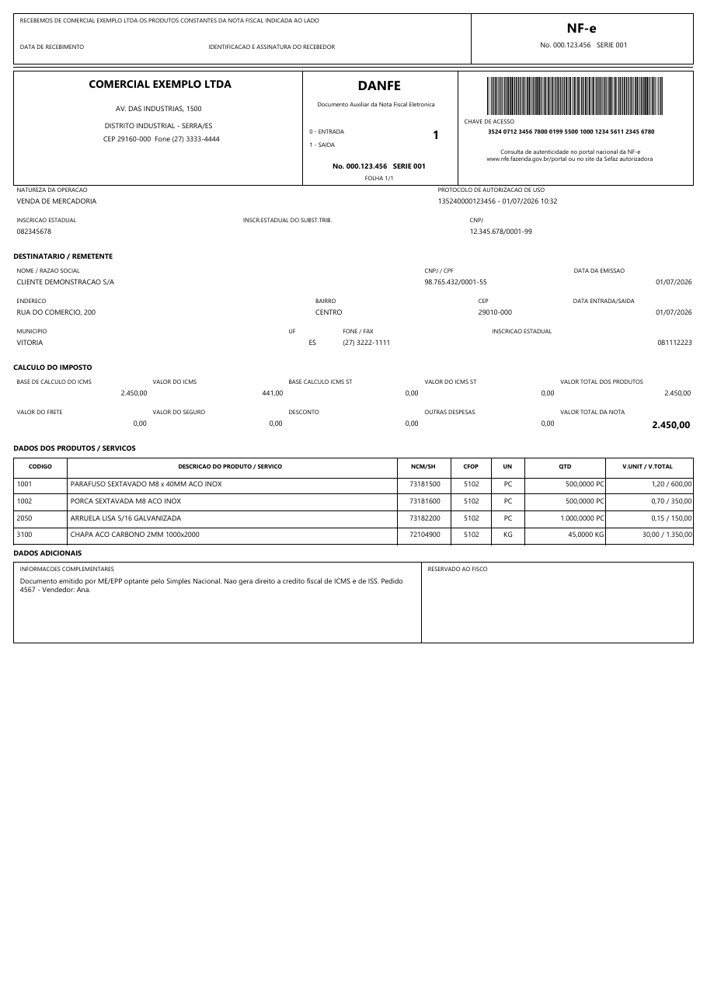

*Fonte: [`demos/danfe_build.py`](../demos/danfe_build.py) · HTML fiel: [`exemplos/danfe.html`](exemplos/danfe.html)*

**Como criar do zero:** página A4 retrato (`X0=0`, `W=mm(210)−2·mm(4)`); na `masterData` "Nota" o canhoto, depois o bloco de 3 colunas emitente | DANFE | (barcode+chave) separadas por `vline`; linhas natureza/protocolo, IE/CNPJ e o quadro DESTINATÁRIO com `cell(...)`; CÁLCULO DO IMPOSTO em duas fileiras de 5 células (a última, **VALOR TOTAL DA NOTA**, em negrito); cabeçalho da tabela (na master) + a `detailData` "Itens" percorrendo o mesmo `product_columns()`; `summary` "Adicionais" dividida 60/40.

### 19.2 NFC-e — Nota Fiscal de Consumidor

Cupom em **bobina térmica de 80 mm** (modelo 65). Fluxo centralizado, colunas finas, e o código fiscal é um **QR Code** na banda de totais.

| Papel | Bandas | Código fiscal |
|---|---|---|
| 80 × 122 mm · margem 2 mm | `masterData` Venda + `detailData` Itens + `summary` Totais | QR Code |

QR centralizado pela largura útil (o QR é quadrado):

```python
qr = mm(34)
qrcode(o, X0 + (W - qr) // 2, y, qr, "[qr_conteudo]")
```

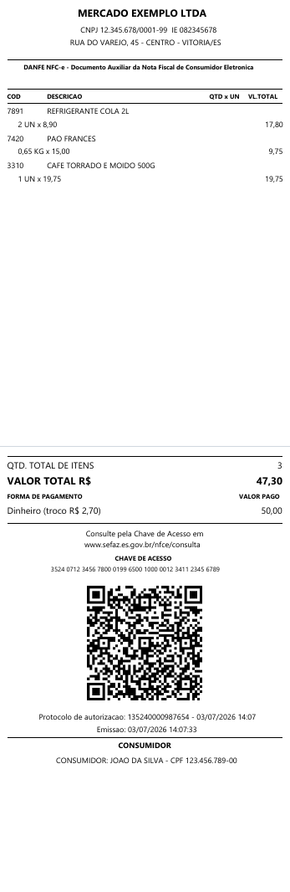

*Fonte: [`demos/nfce_build.py`](../demos/nfce_build.py) · HTML fiel: [`exemplos/nfce.html`](exemplos/nfce.html). Com estes dados o cupom ocupa 2 páginas — o QR e os totais ficam na página 2.*

### 19.3 DACTE — Conhecimento de Transporte (CT-e)

A4 retrato, modal rodoviário (modelo 57). Introduz o idioma de **seções** (`sect()`) e um laço que gera os blocos **remetente/destinatário** lado a lado.

| Papel | Bandas | Código fiscal |
|---|---|---|
| A4 retrato · margem 4 mm | `masterData` CTe + `detailData` Docs + `summary` Obs | Code128 (chave) |

```python
half = W // 2
for (lbl, pre) in (("REMETENTE", "rem"), ("DESTINATARIO", "dest")):
    xh = X0 if lbl == "REMETENTE" else X0 + half
    wh = half if lbl == "REMETENTE" else W - half
    cell(o, xh, y,       wh, mm(8), lbl,        "[%s_nome]" % pre, valign_val="left")
    cell(o, xh, y+mm(8), wh, mm(8), "ENDERECO", "[%s_end]"  % pre, valign_val="left")
```

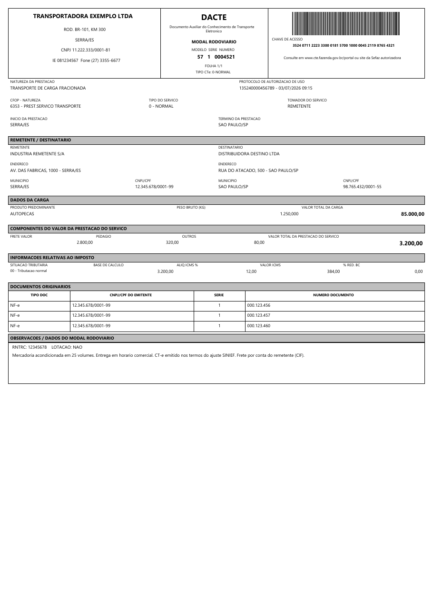

*Fonte: [`demos/dacte_build.py`](../demos/dacte_build.py) · HTML fiel: [`exemplos/dacte.html`](exemplos/dacte.html)*

### 19.4 DAMDFE — Manifesto (MDF-e)

A4 retrato (modelo 58). Único documento que usa **barcode E QR juntos**: QR no cabeçalho e um Code128 da chave numa faixa própria; as chaves de 44 dígitos aparecem **mascaradas dentro das linhas de detalhe**.

| Papel | Bandas | Código fiscal |
|---|---|---|
| A4 retrato · margem 4 mm | `masterData` MDFe + `detailData` Docs + `summary` Obs | Code128 **+** QR |

Faixa de métricas por divisão igual (6 colunas uniformes):

```python
cols = [("UF CARREG.","uf_ini"), ("UF DESCARREG.","uf_fim"), ("QTD. CT-e","qtd_cte"),
        ("QTD. NF-e","qtd_nfe"), ("PESO TOTAL (KG)","peso"), ("VALOR TOTAL R$","valor")]
cw = W // len(cols)
for i, (lbl, fld) in enumerate(cols):
    cell(o, X0 + i*cw, y, cw, ROW, lbl, "[%s]" % fld)
```

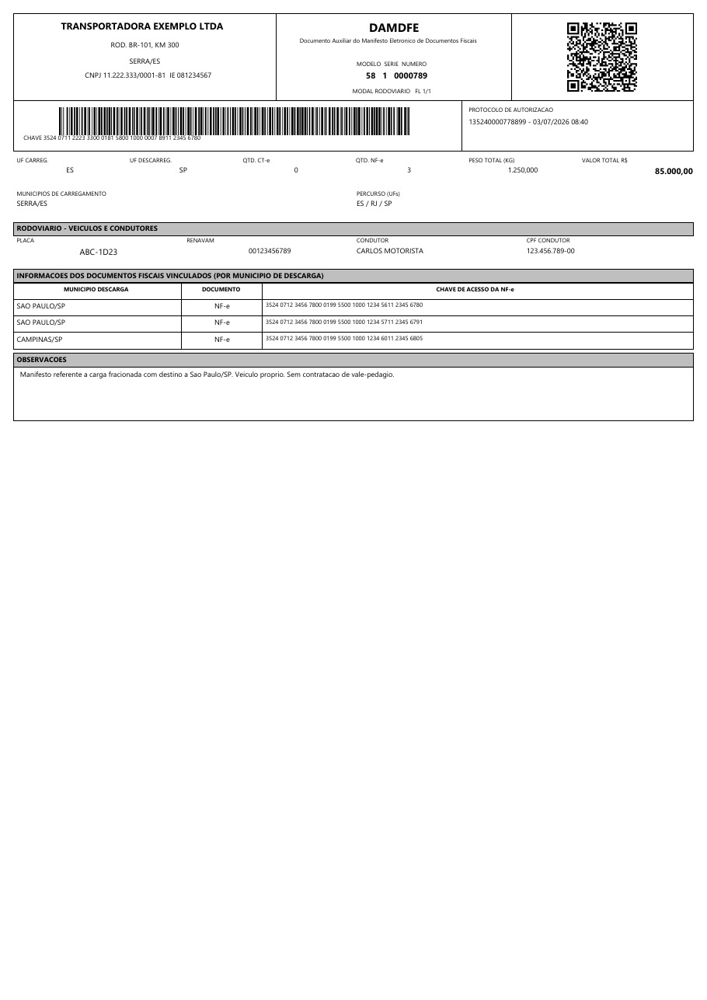

*Fonte: [`demos/mdfe_build.py`](../demos/mdfe_build.py) · HTML fiel: [`exemplos/mdfe.html`](exemplos/mdfe.html)*

### 19.5 NFS-e — Nota Fiscal de Serviço

A4 retrato, layout municipal genérico. Único documento de **serviço** (sem barcode/QR): grades de retenção e um **destaque de VALOR LÍQUIDO**.

| Papel | Bandas | Código fiscal |
|---|---|---|
| A4 retrato · margem 6 mm | `masterData` Nota + `detailData` Serviços + `summary` Totais | — |

Grade de retenções por laço (IRRF/PIS/COFINS/CSLL/INSS):

```python
ret = [("IRRF","irrf"), ("PIS","pis"), ("COFINS","cofins"), ("CSLL","csll"), ("INSS","inss")]
rw = W // len(ret)
for i, (lbl, fld) in enumerate(ret):
    cell(o, X0 + i*rw, y, rw, ROW, lbl, "[FORMATFLOAT('#,##0.00', %s)]" % fld)
```

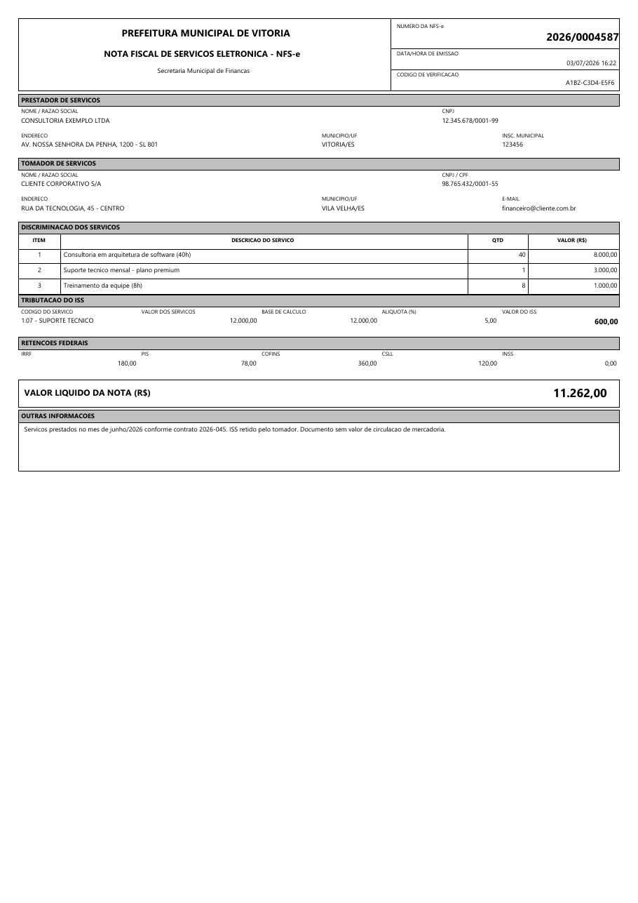

*Fonte: [`demos/nfse_build.py`](../demos/nfse_build.py) · HTML fiel: [`exemplos/nfse.html`](exemplos/nfse.html)*

### 19.6 DACCE — Carta de Correção (CC-e)

Evento da NF-e. Estruturalmente o mais simples: **uma única banda** `masterData` (sem itens), com destaque para o **texto legal justificado** com quebra de linha.

| Papel | Bandas | Código fiscal |
|---|---|---|
| A4 retrato · margem 6 mm | `masterData` CCe (banda única) | Code128 (chave) |

```python
CONDICOES = "A Carta de Correcao e disciplinada pelo paragrafo 1o-A do art. 7o ..."
box(o, X0, y, W, mm(26))
txt(o, X0 + mm(2), y + mm(1.5), W - mm(4), mm(24), CONDICOES,
    size=8, wrap=True, align="justify")
```

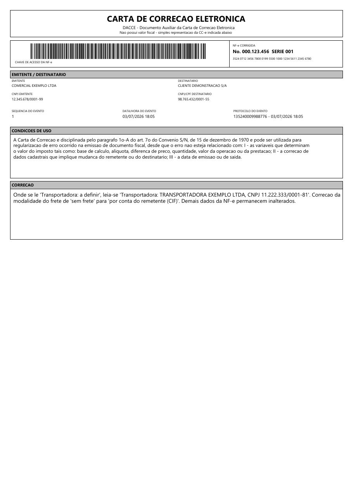

*Fonte: [`demos/dacce_build.py`](../demos/dacce_build.py) · HTML fiel: [`exemplos/dacce.html`](exemplos/dacce.html)*

---

## 20. Galeria de demos

Além dos fiscais, o repositório traz demos genéricos (varejo/escritório, dados fictícios) que exercitam agrupamento, subtotais, master-detail, paisagem, mala direta e gráfico. Os `.rhr` estão em `demos/`; regenere os prints com `py docs/build_gallery.py`.

| Demo | Mostra |
|---|---|
| [`fatura`](../demos/fatura.rhr) | Fatura/duplicata com itens, parcelas e bloco de boleto (linha digitável + Code128); **multi-detail** (dois datasets). |
| [`matricial`](../demos/matricial.rhr) | Relatório matricial em **paisagem**, grupos com subtotais e paginação `Folha [PAGE]/[TOTALPAGES]`. |
| [`mala_direta`](../demos/mala_direta.rhr) | Mala direta — **uma carta por destinatário** (uma página por registro). |
| [`catalogo`](../demos/catalogo.rhr) | Catálogo de produtos com **código de barras (Code128)** e **QR** por item. |
| [`vendas`](../demos/vendas.rhr) | Vendas por categoria com subtotais, total geral e **gráfico de barras**. |

| | | |
|:--:|:--:|:--:|
| 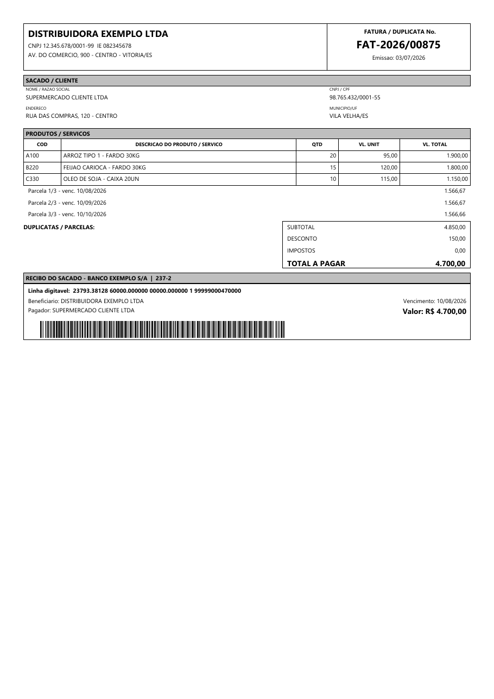 | 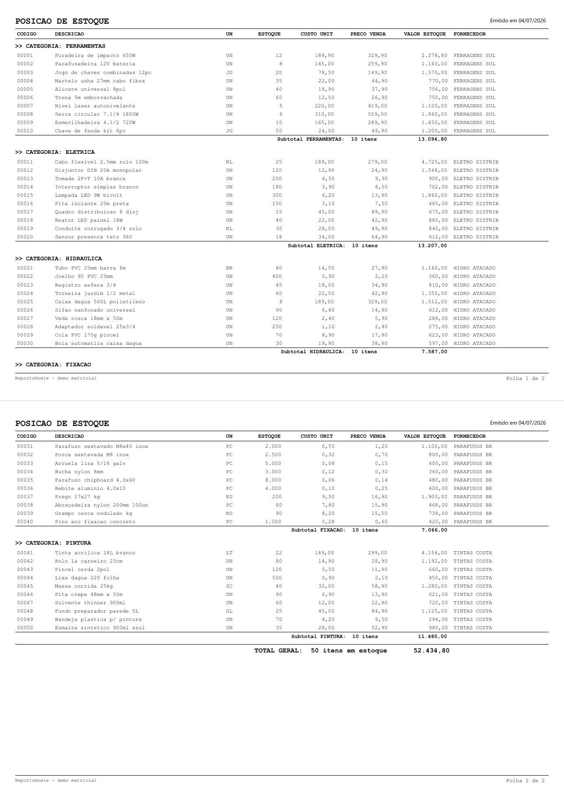 | 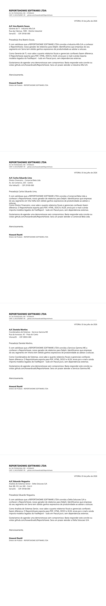 |
| **fatura** | **matricial** | **mala direta** |
| 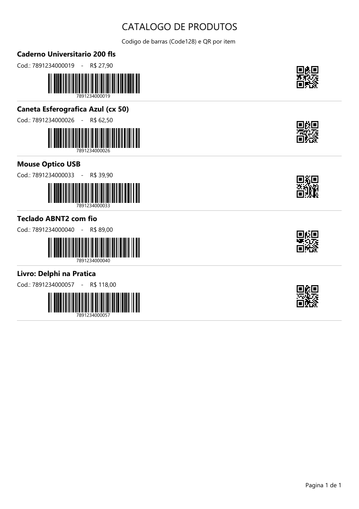 | 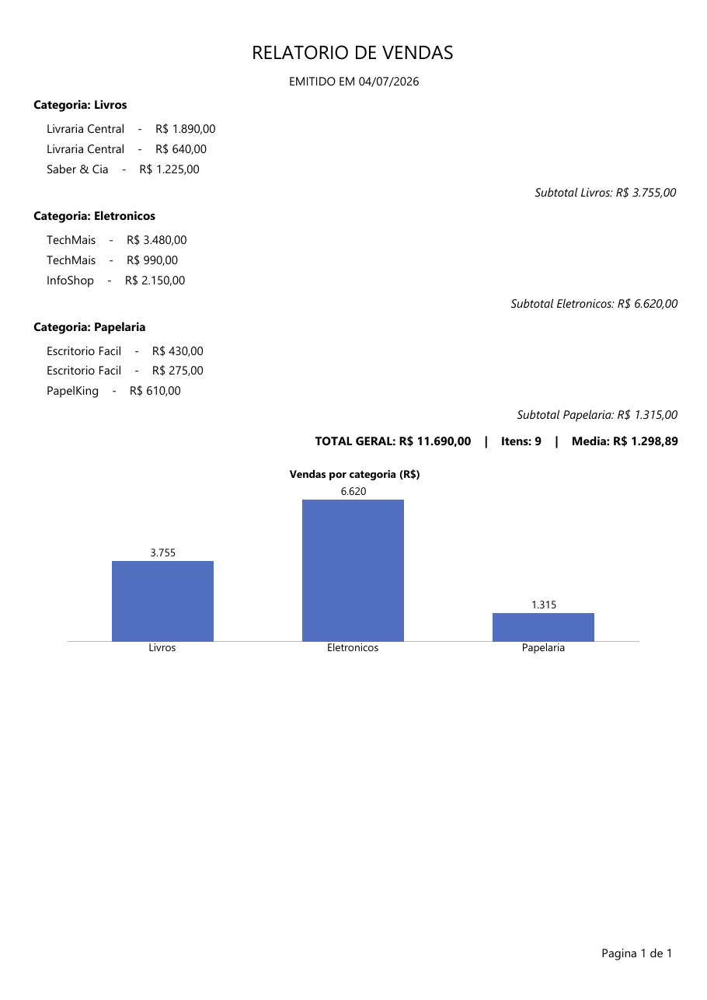 | |
| **catálogo** | **vendas** | |

---

*ReportsHowie — https://github.com/howardroatti/ReportsHowie — LGPL-3.0. Contribuições são bem-vindas; veja `CONTRIBUTING.md`.*
